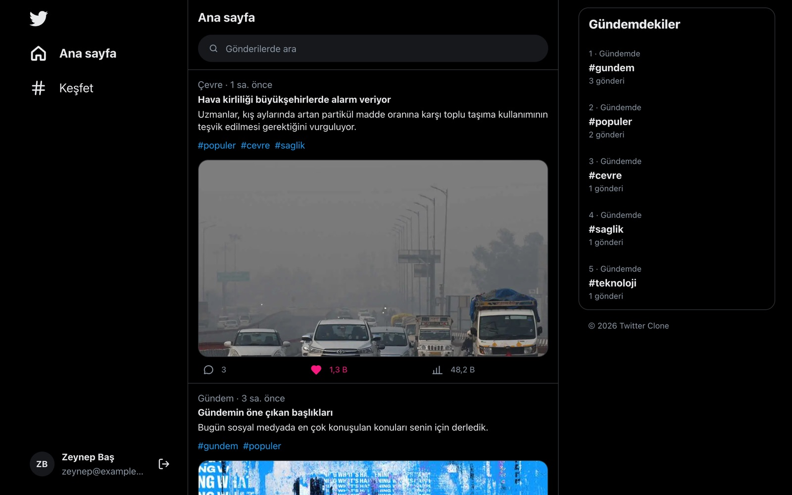
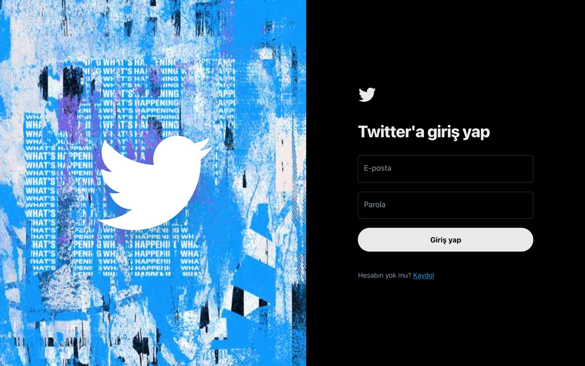
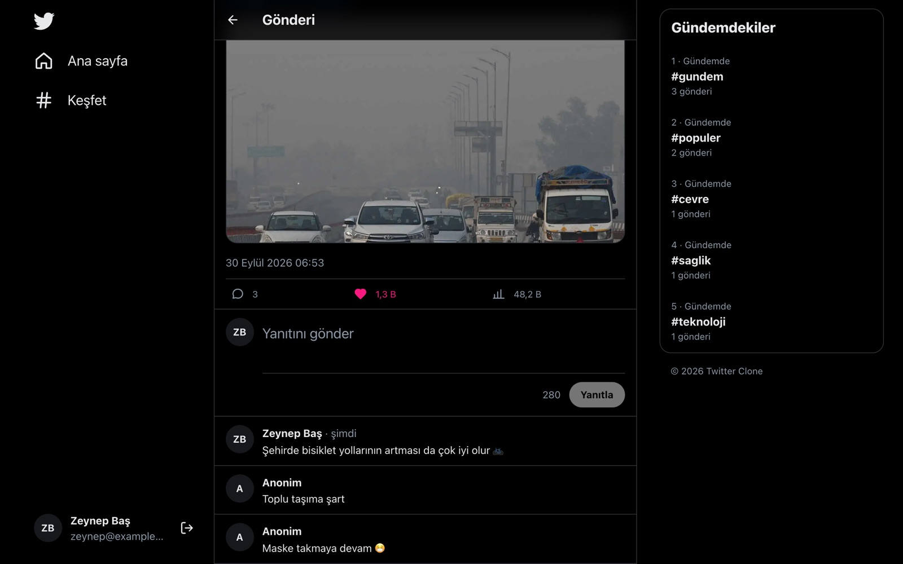
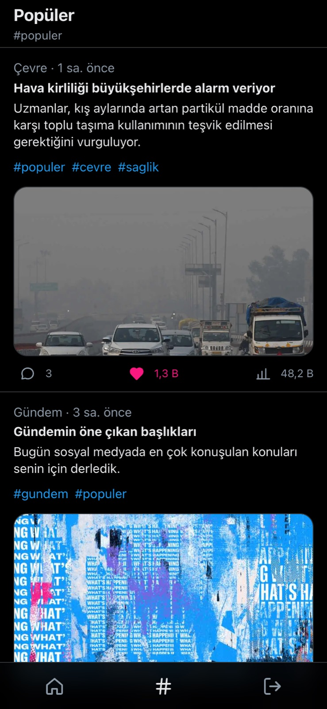

# Twitter Clone

React, Redux Toolkit ve Node.js ile geliştirilmiş Twitter klonu.



| Giriş | Gönderi detayı | Mobil |
| --- | --- | --- |
|  |  |  |

## Özellikler

- Kayıt, giriş ve JWT ile oturum yönetimi
- Sonsuz kaydırmalı akış, arama ve etiket sayfaları
- Beğeni, yorum ve görüntülenme sayacı
- Gündemdeki etiketler
- Mobil uyumlu arayüz

## Teknolojiler

**Frontend:** React 19, Redux Toolkit (RTK Query), React Router, Tailwind CSS v4, Vite
**Backend:** Node.js, Express 5, MongoDB (Mongoose), Zod, JWT

## Kurulum

```bash
# backend
cd backend
cp .env.example .env   # MONGO_URI ve JWT_SECRET değerlerini doldurun
npm install
npm run dev

# frontend
cd frontend
cp .env.example .env
npm install
npm run dev
```

Uygulama `http://localhost:5173`, API `http://localhost:9380` adresinde çalışır.
